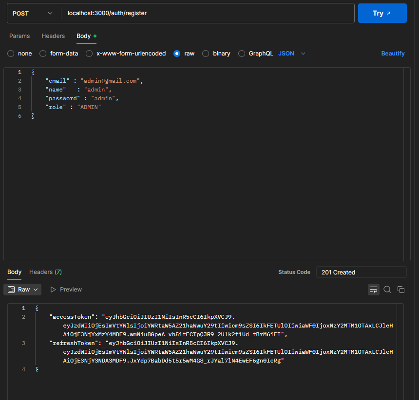
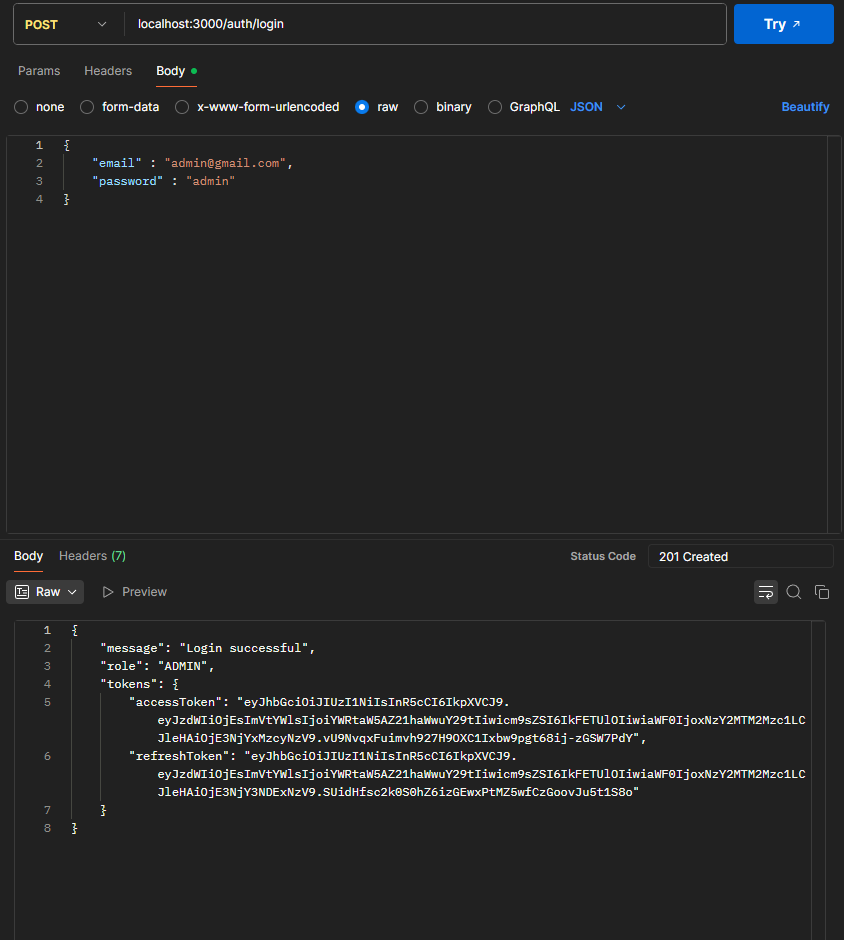
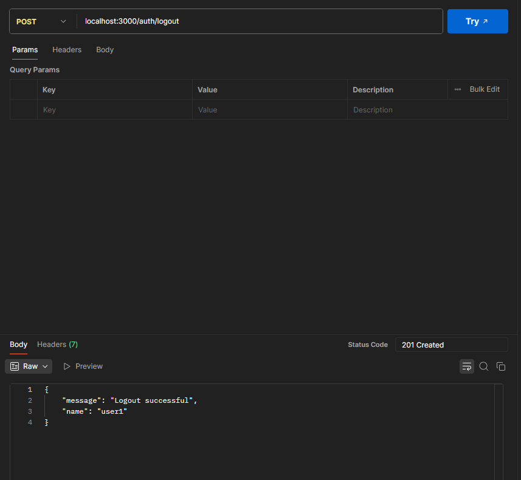
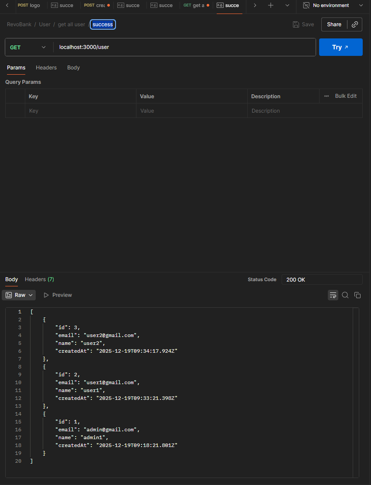
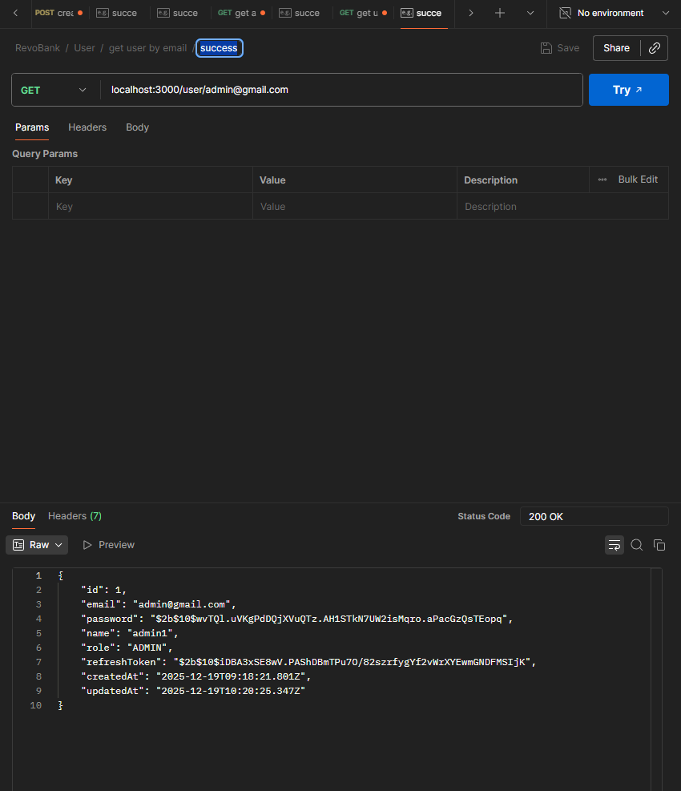
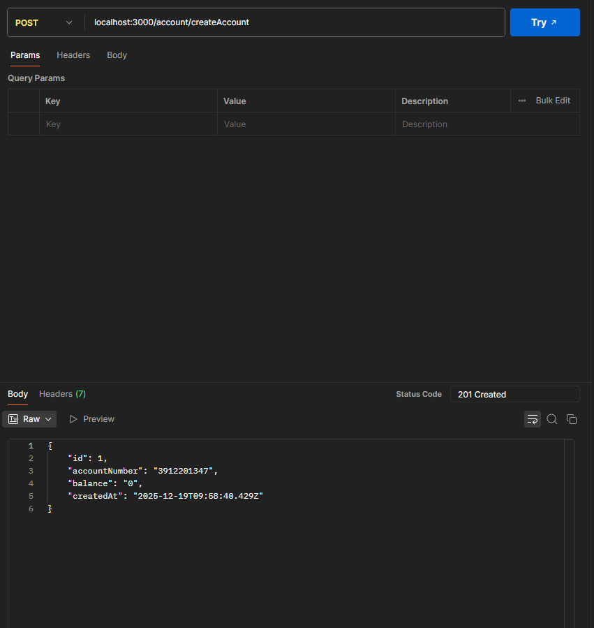
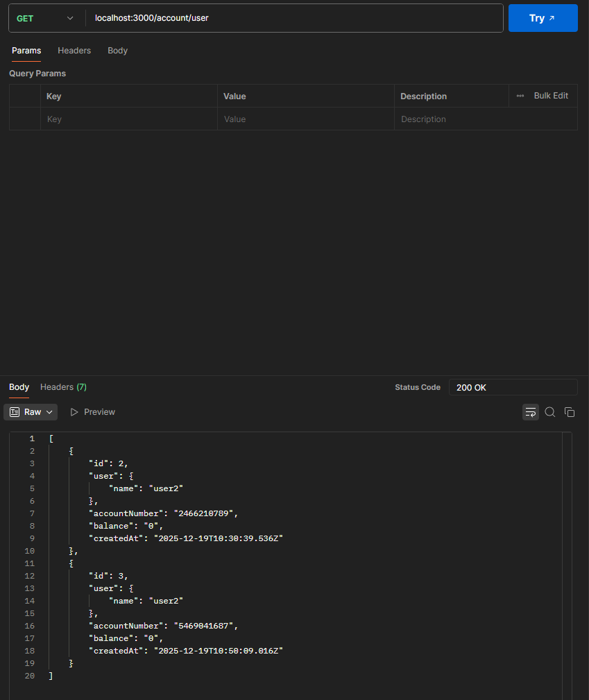
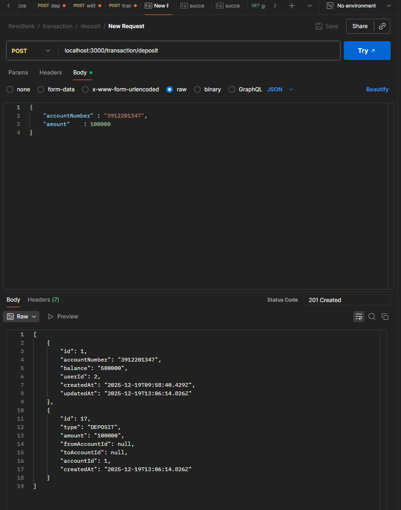
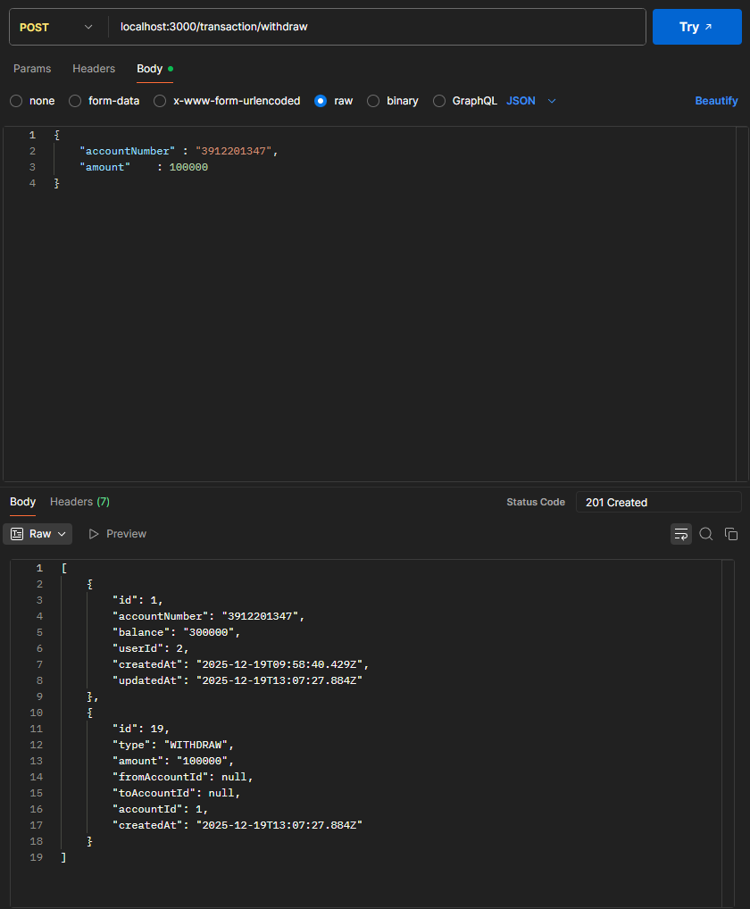
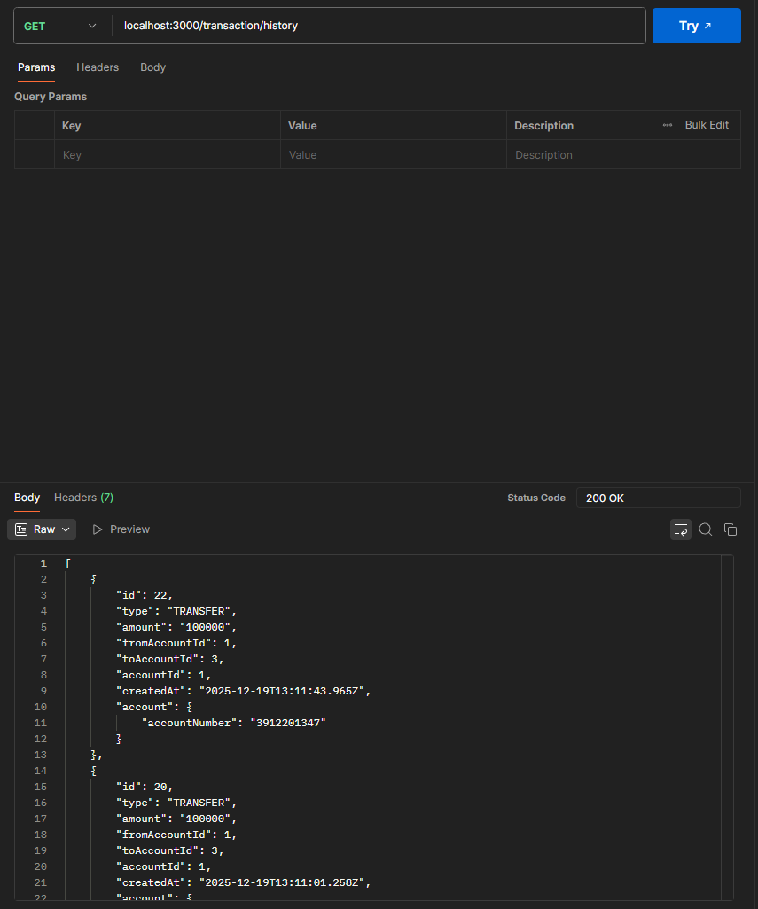

## RevoBank

Revo Bank - Simple Banking API (NestJS + Prisma)

---

## Description

This repository is a small banking API built with **NestJS**, and **Prisma** (PostgreSQL). It provides user registration/authentication, account management, and basic transaction operations (deposit, withdraw, transfer) with JWT-based authentication.

---

## Tech Stack

- Node.js (16+)
- TypeScript
- NestJS
- Prisma ORM (PostgreSQL)
- Jest
- pnpm

---

## Project Structure

```
src/
  app.controller.ts
  app.service.ts
  main.ts
  auth/
    auth.controller.ts      # register, login, logout
    auth.service.ts
    guard/                  # JWT, role-related guards
  user/
    user.controller.ts      # user register, list, get by email, update
    user.service.ts
  account/
    account.controller.ts   # create account, get accounts
    account.service.ts
  transaction/
    transaction.controller.ts # deposit, withdraw, transfer, history
    transaction.service.ts
  prisma/
    prisma.service.ts
prisma/
  schema.prisma
README.md

```

---

## Getting Started

Install dependencies:

```bash
pnpm install
```

Generate Prisma client:

```bash
pnpm prisma generate
```

Run migrations:

```bash
pnpm prisma migrate dev --name init
```

---

## Database (Prisma)

- Schema is defined in `prisma/schema.prisma`.
- Provider: **postgresql**.
- Models: `User`, `Account`, `Transaction` with enums for `Role` and `TransactionType`.

---

## Running the App

Start in development mode:

```bash
pnpm run start:dev
```

---

## API Endpoints 🔌

Authentication: all authenticated endpoints expect a header:

```
Authorization: Bearer <accessToken>
```

1. Auth

- POST /auth/register
  - Body: `{ "name": "admin", "email": "admin@gmail.com", "password": "admin", "role" : "ADMIN" }`
  - Response: `{ accessToken, refreshToken }
`
    
  - Description: Registers a new user and returns access & refresh tokens.

- POST /auth/login
  - Body: `{ "email": "admin@gmail.com", "password": "admin" }`
  - Response: `{ message: 'Login successful', role, tokens }`
    
  - Description: Authenticates a user and returns tokens.

- POST /auth/logout (Protected)
  - Header: `Authorization: Bearer <accessToken>`
  - Response: `{ message: 'Logout successful', name }`
    
  - Description: Clears stored refresh token for the user.

2. User

- GET /user
  - Header: `Authorization: Bearer <adminToken>`
  - Response: `[ user, ... ]`
    
  - Description: List all users.

- GET /user/:email
  - Header: `Authorization: Bearer <token>`
  - Example: `/user/admin@gmail.com`
  - Response: user object
    
  - Description: Get user by email.

- PUT /user/:id
  - Body: partial user update
  - Response: updated user
    
  - Description: Update user data.

3. Account

- POST /account/createAccount
  - Header: `Authorization: Bearer <token>`
  - Response: created account object (accountNumber, balance)
    
  - Description: Create a new bank account for authenticated user.

- GET /account/account
  - Header: `Authorization: Bearer <token>`
  - Response: `[ accounts ]`
    
  - Description: Get accounts belonging to the authenticated user.

4. Transaction

- POST /transaction/deposit
  - Body: `{ "accountNumber": "3912201347", "amount": 100000 }`
  - Response: created transaction object / success message
    
  - Description: Deposit money into an account.

- POST /transaction/withdraw
  - Body: `{ "accountNumber": "3912201347", "amount": 100000 }`
  - Response: transaction or error if insufficient funds
    
  - Description: Withdraw money from an account.

- POST /transaction/transfer
  - Body: `{ "fromAccountNumber": "3912201347", "toAccountNumber": "5469041687", "amount": 100000 }`
  - Response: transaction showing transfer details
    
  - Description: Transfer money from one account to another.

- GET /transaction/history
  - Header: `Authorization: Bearer <token>`
  - Response: `[ transactions ]`
    
  - Description: Get transaction history for the authenticated user.

---

## Contact

Email: [youssibarani17@gmail.com](mailto:youssibarani17@gmail.com)
